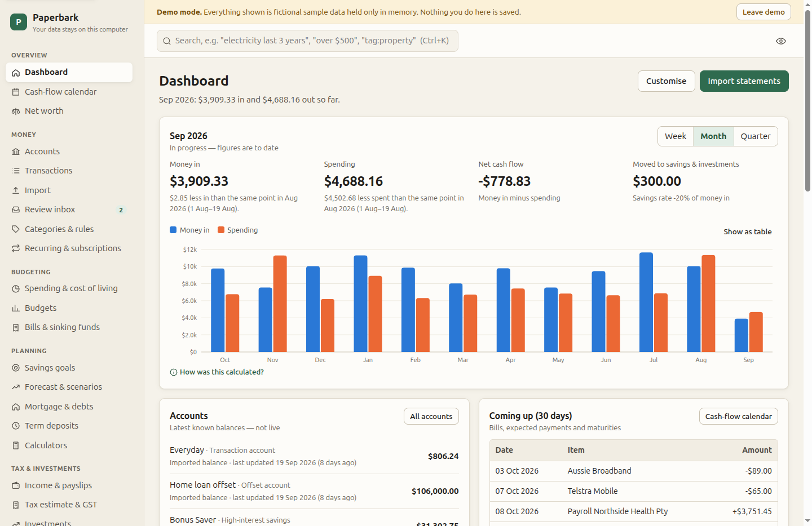
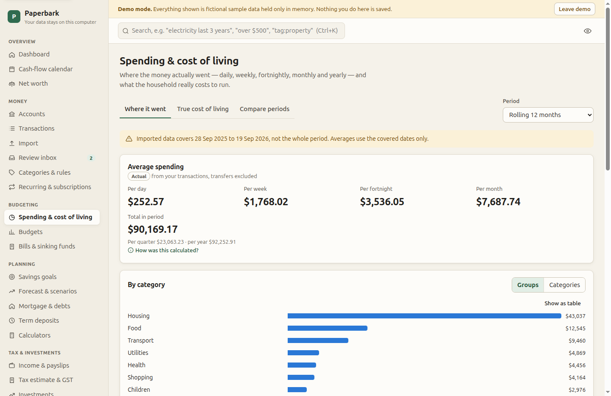
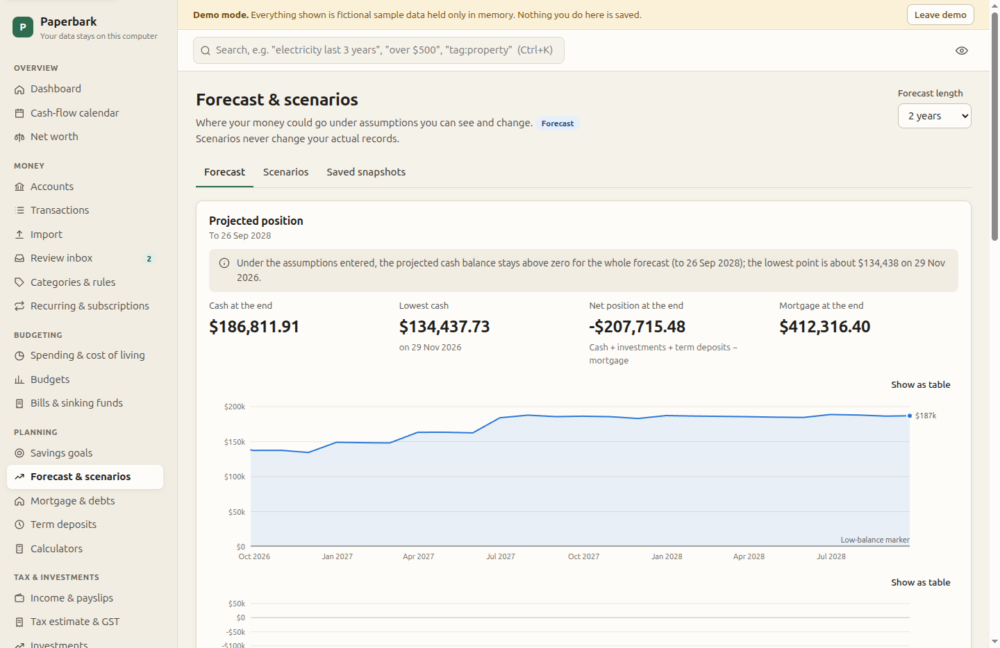
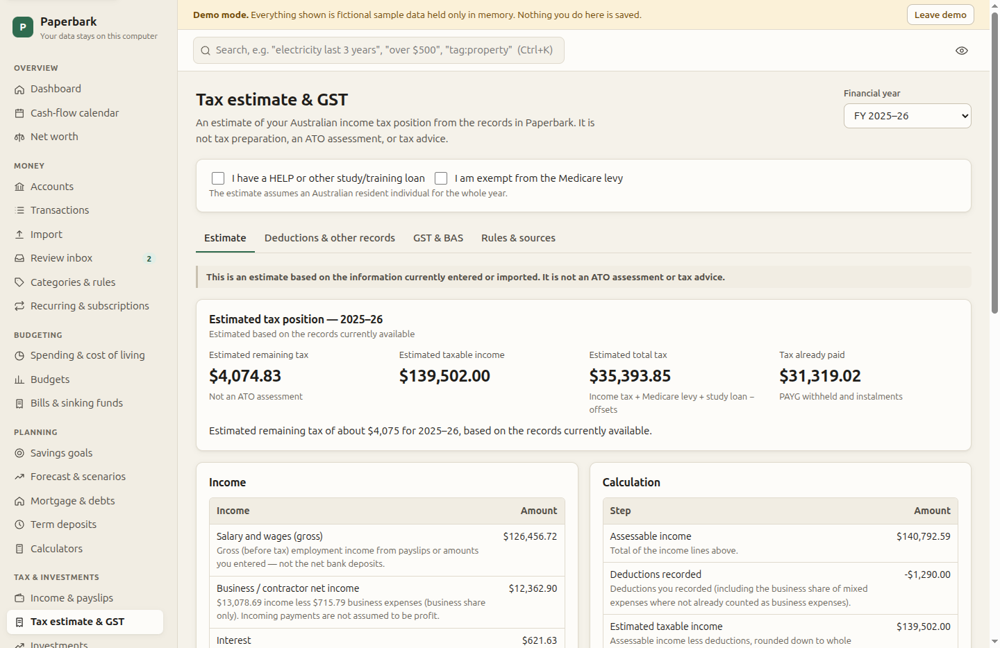

# Paperbark — personal finance for Australian households

**See where your money went. Understand where it is going. Model where it could go next.**

Paperbark is a desktop app (Windows, macOS, Linux) for tracking, understanding and planning household money in Australia. You import the statements you download from your bank; Paperbark shows where the money went, what it really costs to live, what is coming up, and what different decisions could look like — including an estimate of your Australian income tax.

It is **local-first**: there is no account and no server. Your data is encrypted on your own computer. Paperbark never logs in to your bank, never uses Open Banking/CDR, never scrapes websites, and sends no analytics.

> **Not financial or tax advice.** Paperbark does arithmetic on the records and assumptions you enter. It never recommends a product, a lender, an investment or a course of action. Tax figures are estimates, not an ATO assessment.

| Dashboard | Spending & cost of living | Forecast & scenarios | Tax estimate |
|---|---|---|---|
|  |  |  |  |

*Screenshots use the built-in demo household — every name and number is fictional.*

---

## What it does

| Area | Highlights |
|---|---|
| **Import** | CSV, OFX, QFX, QIF, XLS, XLSX and text-based PDF statements. A mapping wizard for unfamiliar layouts, saved import profiles, duplicate detection, running-balance and statement-balance reconciliation, undo. Anything uncertain waits in the **Review inbox** instead of silently changing your figures. See [docs/IMPORT_FORMATS.md](docs/IMPORT_FORMATS.md). |
| **Understand** | Categories with rules you can read and edit (learning is suggestion-only unless you opt in), split transactions, tags, notes, change history, transfer matching, recurring payment and subscription detection, week/fortnight/month/quarter/financial-year analysis, **true cost of living** (annual and lumpy costs spread into weekly/fortnightly/monthly amounts), neutral period comparisons, income by source, net worth with dated values, search in plain English ("electricity last 3 years", "over $500", "tag:property"). |
| **Budget** | Budgets from your history, entered by hand, or both; any period length; wording that describes differences without judging them. Bills, sinking funds and reminders. |
| **Plan** | A cash-flow calendar, a day-by-day forecast with scenarios (career break, reduced hours, retirement, property purchase, rate change… all editable examples), saved snapshots to compare later, savings goals, compound-growth, loan and super calculators, mortgage modelling with **offset accounts**, debt payoff by an order you choose, and term-deposit ladders. |
| **Tax** | Versioned Australian tax rules for 2024–25 to 2027–28 with ATO sources and review dates: resident rates, Medicare levy and low-income reduction, LITO, study-loan repayments, franking credits, CGT records (12-month discount), payslips, deductions, PAYG instalments, sole-trader/contractor income, business-use percentages, and GST/BAS preparation summaries. See [docs/TAX_RULES.md](docs/TAX_RULES.md). |
| **Records** | Encrypted document storage (receipts, statements, payslips), investment holdings with trades, dividends and franking, super statements and contribution caps. |
| **Export** | Excel workbooks with **live formulas** (checked by recalculating in LibreOffice), CSV (spreadsheet-safe), Google Sheets (snapshot or managed, using only the `drive.file` permission), 17 reports and an accountant package. |
| **Privacy & safety** | AES-256-GCM encrypted database and documents, OS keychain or password protection, auto-lock, privacy mode (hide amounts), encrypted backups you store wherever you like, a network log that shows every request the app has made. See [docs/SECURITY_PRIVACY.md](docs/SECURITY_PRIVACY.md). |
| **Accessible** | Keyboard navigation, focus management in dialogs, a table view for every chart, light/dark/high-contrast themes, adjustable text size, colour never the only signal. |

Every calculated figure has a **"How was this calculated?"** panel showing the inputs, the period covered and any gaps. When data is missing (for example a credit card with no statements since July), Paperbark says so instead of presenting incomplete numbers as complete.

## Getting Paperbark

Installers are published on the [releases page](https://github.com/BearyNatural/claude/releases) with tags `finance_app-v<version>-build<n>` (marked as pre-releases while the app is at 0.x):

| System | Download | First run |
|---|---|---|
| **Windows** | `Paperbark-<version>-win-x64.exe` | Not code-signed yet: if Windows says *"Windows protected your PC"*, choose **More info › Run anyway**. |
| **macOS** (Apple silicon) | `Paperbark-<version>-mac-arm64.dmg` | Not notarised yet: drag to Applications, then **right-click › Open** the first time. |
| **Linux** | `.deb` (Debian/Ubuntu, recommended) or `.AppImage` | The `.deb` sets up Electron's sandbox helper. The AppImage may need `--no-sandbox` on distributions that restrict unprivileged user namespaces (e.g. Ubuntu 24.04). |

Each release includes `SHA256SUMS.txt`. Each installer's app passed a built-in self-test (`--self-test`) on its own operating system before being published.

**Try it without your own data:** on the first screen choose **Explore with demo data**. The demo household lives only in memory and disappears when you leave demo mode.

## Where your data lives

Everything is in one folder on your computer:

| System | Folder |
|---|---|
| Windows | `%APPDATA%\Paperbark\vault` |
| macOS | `~/Library/Application Support/Paperbark/vault` |
| Linux | `~/.config/Paperbark/vault` |

The database (`paperbark.pbdb`) and every attached document are encrypted. Uninstalling Paperbark does not delete this folder. Make regular encrypted backups (**Backup & restore**) to a USB drive, NAS or a synced cloud folder — Paperbark keeps no copy anywhere else, so a lost password or disk cannot be recovered by anyone.

## Running from source

Requires **Node.js 22.12+** (see `.nvmrc`).

```bash
cd finance_app
npm ci
npm run dev          # build (development) and start the app
npm test             # 175 unit and integration tests
npm run typecheck
npm run package      # installers for the current OS → release/
```

The LibreOffice recalculation test runs only when `soffice` is installed; it is skipped otherwise.

## Documentation

| Document | Contents |
|---|---|
| [docs/PROJECT_REPORT.md](docs/PROJECT_REPORT.md) | End-of-project report: what was built, how each engine works, test results, known limitations, security work before public release, next steps |
| [docs/ARCHITECTURE.md](docs/ARCHITECTURE.md) | Processes, layers, data model, IPC, build and packaging |
| [docs/DECISIONS.md](docs/DECISIONS.md) | Key technical decisions and why (Electron over Tauri, sql.js, own XLSX writer…) |
| [docs/SECURITY_PRIVACY.md](docs/SECURITY_PRIVACY.md) | Threat model, encryption, app lock, backups, network behaviour, release hardening |
| [docs/IMPORT_FORMATS.md](docs/IMPORT_FORMATS.md) | Exactly which statement formats work, and their limitations |
| [docs/CALCULATIONS.md](docs/CALCULATIONS.md) | Formulas for averages, cost of living, budgets, forecasts, loans, term deposits, goals |
| [docs/TAX_RULES.md](docs/TAX_RULES.md) | Tax years supported, components, sources, review dates and omissions |
| [CHANGELOG.md](CHANGELOG.md) | Release history |

## Project layout

```
finance_app/
  src/domain/     pure calculation engines (no Electron, no I/O) — money, dates, import parsers,
                  categorising, analysis, budgets, planning, Australian tax, spreadsheet output
  src/main/       Electron main process — encrypted storage, services, validated API, Google, backups
  src/preload/    the narrow bridge the UI may use
  src/renderer/   React UI
  tests/          vitest: domain, services, storage, imports (incl. generated PDFs), demo integration
  ci/             finance_app-ci.yml (checks) and finance_app-desktop.yml (installers & release)
  build/          app icon
```
