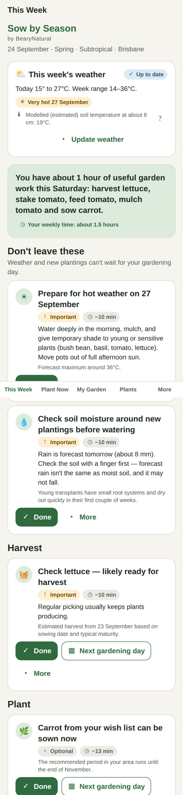
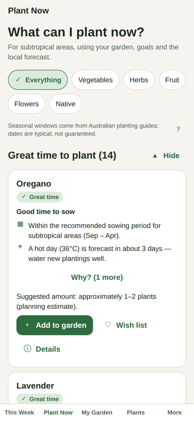
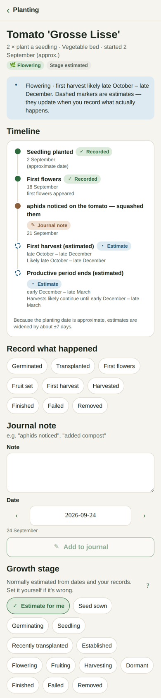
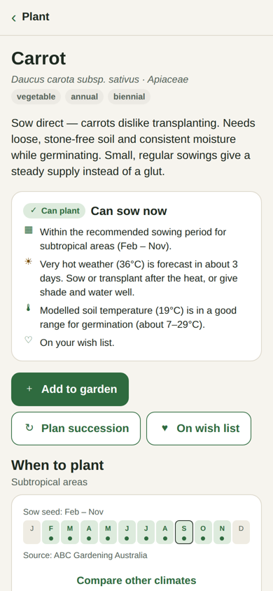

# Sow by Season — by BearyNatural

*Know what to plant. Know when to plant it.*

Sow by Season is a garden-planning app for Australian gardeners. It helps you answer four questions:

1. **What can I plant now?** Suggestions for your climate zone, the season, the local forecast and your garden, each with the reasons behind it.
2. **What should I do this week?** Jobs worked out from what you're actually growing, sized to the time you have.
3. **What is happening in my garden?** Your plantings, their estimated growth stages, and a timeline of expected flowering and harvest that updates as you record what really happens.
4. **What should I plant next?** Seasonal and succession-planting plans, your wish list, and structured systems such as Three Sisters.

It runs on Android and iPhone, and in a browser for development. It is **local-first**: there's no account, BearyNatural keeps no server copy of your garden, and all the core features work offline.

| This Week | Plant Now | Planting timeline | Plant detail |
|---|---|---|---|
|  |  |  |  |

> **About these screenshots:** they come from a headless verification build that runs the app's real code (screens, store, gardening engine and storage) in Chromium, with a thin stand-in for React Native. The weather is mocked for the demo. They are **not** from a phone or from Expo's own web build. The development report explains why.

---

## Install on an Android phone

1. On your phone, open the repository's **Releases** page (GitHub → BearyNatural/claude → Releases) and open the latest **Sow by Season** release.
2. Tap the **`SowBySeason-….apk`** file to download it, then open it from the notification or your Files/Downloads app.
3. If asked, allow your browser or Files app to **install unknown apps**, then tap **Install**.
4. To update later, install the newest release over the top. Your garden data is kept, as long as the signing secrets described below are set up.

New releases are built automatically by GitHub Actions (`ci/garden_app-android.yml`, copied to `.github/workflows/` by `publish-to-github.sh`) whenever code in `garden_app/` changes on `main`, or when you choose **Actions → garden_app · Android build & release → Run workflow**. Releases are tagged `garden_app-v<version>-build<n>`.

Every week the repository's **Weekly maintenance** workflow also scans this project (secrets, static analysis, vulnerable or badly-licensed dependencies, tests, type-check), updates dependencies to the newest Expo-compatible versions and, if tests still pass, bumps the patch version and publishes a new release. Problems are flagged in the run summary and in a GitHub issue named *Weekly maintenance: garden_app*.

iPhone isn't packaged yet. Installing on an iPhone needs an Apple Developer account (TestFlight or the App Store).

## Contents

- [Technology stack](#technology-stack)
- [Architecture](#architecture)
- [Setup and running](#setup-and-running)
- [Tests](#tests)
- [Building for devices](#building-for-devices)
- [External services](#external-services)
- [Environment variables](#environment-variables)
- [Storage behaviour](#storage-behaviour)
- [Privacy model](#privacy-model)
- [Backup format](#backup-format)
- [Horticultural data and its limits](#horticultural-data-and-its-limits)
- [Known limitations](#known-limitations)
- [Future development](#future-development)

More documents:

- [`docs/ARCHITECTURE.md`](docs/ARCHITECTURE.md): how the pieces fit together, and the gardening engine in detail
- [`docs/adr/`](docs/adr/): architecture decision records
- [`docs/DATA_REVIEW.md`](docs/DATA_REVIEW.md): the plant data that needs horticultural review
- [`DEVELOPMENT_REPORT.md`](DEVELOPMENT_REPORT.md): the build report

---

## Technology stack

| Concern | Choice |
|---|---|
| App framework | **Expo SDK 57** (React Native 0.86, React 19.2) with **TypeScript** |
| Navigation | **expo-router** (file-based: `app/`) |
| State | A small dependency-free observable store (`src/state/gardenStore.ts`) read through `useSyncExternalStore` |
| Local storage | `@react-native-async-storage/async-storage` behind a `KeyValueStore` interface, with one record per key |
| Weather | [Open-Meteo](https://open-meteo.com) forecast API. No key is needed for non-commercial use |
| Place search | Open-Meteo geocoding (optional; an offline town list is built in) |
| Notifications | `expo-notifications`, **local only** |
| Backup files | `expo-file-system`, `expo-sharing`, `expo-document-picker` (the phone's own file providers) |
| Tests | Node's built-in test runner via `tsx`. The domain has no dependencies, so the tests need no emulator |

## Architecture

```
app/                    Screens (expo-router). Thin: they read state and call actions.
  (tabs)/               This Week · Plant Now · My Garden · Plants · More
  plant/[id]            Plant detail (sources, windows, companions, soil advice…)
  planting/new, [id]    Add a planting; timeline, events, journal, stage
  area/…                Garden areas
  succession/…          Succession plans
  three-sisters, calendar, wishlist, journal, profile, reminders, backup, privacy, glossary, about
src/
  domain/               PURE TypeScript gardening engine — no React, no I/O
    types.ts, plantTypes.ts        data model
    dates.ts, climate.ts, location.ts, windows.ts
    catalogue.ts                   validation + natural-language search
    weather.ts                     freshness (fresh/stale/unavailable) + assessment
    recommend.ts                   "What can I plant now?"
    production.ts                  household quantity model
    succession.ts                  succession plans + accept/postpone/skip/resize/stop
    companions.ts, systems.ts      companion logic; planting systems (Three Sisters)
    rotation.ts, space.ts          crop-family rotation; spacing/overcrowding/sun/pot checks
    timeline.ts                    estimated milestones, replaced by real observations
    tasks.ts, workload.ts          weekly jobs + time-aware prioritisation
    reminders.ts                   consolidated reminder planning
    calendar.ts                    seasonal calendar data
    validation.ts                  runtime validation for every stored record
    backup/                        versioned format, migrations, safe restore
  data/                 Plant catalogue, sources registry, localities, companions, systems, glossary
  services/             I/O adapters: storage, weather, location lookup, notifications, backup files
  state/                Store (actions = domain + persistence), React hooks
  ui/                   Theme tokens, accessible components, shared forms
tests/                  150 automated tests
data-sources/           Raw captures of source data (Gardening Australia monthly lists)
scripts/                Data build scripts
docs/                   Architecture, ADRs, data review, screenshots
```

**Rule of thumb:** the gardening rules live in `src/domain`, not in screens. Plant-specific behaviour lives in the catalogue data: windows, production profiles, tolerances, companions and systems. The engine reads that data. It never uses `if (plant === 'carrot')`.

## Setup and running

Requirements: **Node 22.13+**, npm, and for devices the **Expo Go** app or a development build.

```bash
cd garden_app
bash scripts/ci-install.sh # installs Expo, then lets Expo pick compatible versions of everything else
# (or: npm install && npx expo install --fix)
npm start                  # then press a (Android), i (iOS simulator) or w (web)
```

Other commands:

```bash
npm run web          # browser development preview
npm run android      # open on a connected Android device / emulator
npm run ios          # open in the iOS simulator (macOS)
npm test             # run all automated tests (no emulator needed)
npm run typecheck    # full TypeScript check (needs node_modules installed)
npm run typecheck:domain  # type-check the engine only (works without node_modules)
npm run data:ga-windows   # rebuild planting windows from data-sources/
npm run doctor       # expo-doctor dependency health check
```

> The `package.json` versions were set from the Expo SDK 57 documentation, because the build environment had no access to the npm registry. Run `npx expo install --fix` once after `npm install` so Expo can pin the exact compatible versions.

## Tests

```bash
npm test
```

There are **150 tests in 8 files, and all pass.** They cover Australian season boundaries, timezones and daylight saving, gardens that run across the new year, per-zone recommendations (Brisbane, Hobart, Darwin, Perth, inland Queensland), stale and unavailable weather, modelled soil temperature, frost, heat and heavy rain, household scaling, single-harvest vs repeat-harvest crops, succession limits at the end of the season, succession actions, Three Sisters sequencing, companion evidence levels, overcrowding, rotation, timelines, task generation and prioritisation, available gardening time, reminders, backup, restore, corrupt backups, schema migrations, atomic restore, per-record storage resilience, the weather client and cache, catalogue validation, and one integrated scenario taken from the brief. See the [development report](DEVELOPMENT_REPORT.md#testing).

## Building for devices

The project follows the standard Expo (EAS) workflow:

```bash
npm install -g eas-cli
eas login
eas build:configure
eas build --platform android   # AAB/APK
eas build --platform ios       # needs an Apple Developer account
```

Bundle identifiers are set in `app.json` (`au.com.bearynatural.sowbyseason`). Change them before your first store submission if needed. Location permissions are explicitly **blocked** on Android, because the app never uses GPS.

## External services

| Service | Used for | Sent | Required? |
|---|---|---|---|
| Open-Meteo forecast (`api.open-meteo.com`) | 7-day forecast, frost/heat/rain checks, **modelled** soil temperature | Rounded coordinates (~1 km) and timezone | No. The app falls back to seasonal advice |
| Open-Meteo geocoding (`geocoding-api.open-meteo.com`) | "Search more places online" during location setup | The search text | No. There's an offline town list and a manual state/zone option |

There is no BearyNatural server, analytics, advertising or push-notification service.

**Commercial use:** Open-Meteo's free API is for non-commercial use. A commercial release needs an Open-Meteo API subscription. Set `EXPO_PUBLIC_OPEN_METEO_API_KEY` and the client switches to the customer endpoint automatically.

## Environment variables

Copy `.env.example` to `.env`:

| Variable | Purpose |
|---|---|
| `EXPO_PUBLIC_OPEN_METEO_API_KEY` | Optional. Open-Meteo customer API key for commercial use. |

`EXPO_PUBLIC_*` values are embedded in the app bundle, so don't put secrets there that must stay private.

## Storage behaviour

- **Everything the gardener creates is stored on the device** in AsyncStorage (localStorage on web), **one record per key**. The keys look like `sbs:g<generation>:<collection>:<id>`.
- **One corrupt record never takes the garden down.** Every record is validated when loaded. A record that fails is moved aside to a `sbs:quarantine:*` key (kept, not deleted), and the app tells the gardener.
- **Restore is atomic.** A complete new data "generation" is written and checked. Then a single key (`sbs:meta:generation`) is flipped to make it live. If anything fails before that flip, the partial generation is discarded and the current data stays untouched. Leftovers from an interrupted restore are cleaned up on the next launch.
- Weather is cached under `sbs:cache:weather` with its fetch time, so it can be shown honestly as stale when you're offline.
- The plant catalogue is bundled with the app. It isn't stored per user, and it isn't included in backups.

## Privacy model

In plain language, as it appears on the in-app **Privacy & your data** screen:

- Your garden data is stored locally on your phone.
- BearyNatural doesn't maintain an online garden account or database.
- Your location is used only for climate and weather advice. It's approximate (suburb or postcode, rounded coordinates), and the app never asks for GPS or background location.
- Weather and place-search services receive the information they need to answer each request (approximate coordinates or search text, plus your IP address, as with any web request).
- Clearing the app's data or uninstalling can remove your garden records. Make backups if you want extra protection.
- You can delete everything from the device at any time.

## Backup format

A backup is a JSON file you save wherever your phone lets you: on the device, iCloud Drive, Google Drive, OneDrive, Dropbox, email, and so on. The app uses the operating system's share sheet and document picker, plus a "Save to folder…" option on Android. There's no custom cloud integration. The file is named like `SowBySeason-Backup-2026-09-24.json`:

```json
{
  "format": "sow-by-season-backup",
  "schemaVersion": 2,
  "createdAt": "2026-09-24T08:00:00.000Z",
  "app": { "name": "Sow by Season", "version": "1.0.0" },
  "catalogueVersion": "2026.09.1",
  "counts": { "areas": 1, "plantings": 5, "journal": 2, "wishlist": 2, "successionPlans": 1, "taskResponses": 3, "observations": 0 },
  "checksum": "fnv1a-1a2b3c4d",
  "data": {
    "profile": { … }, "settings": { … },
    "areas": [ … ], "plantings": [ … ], "journal": [ … ], "wishlist": [ … ],
    "successionPlans": [ … ], "taskResponses": [ … ], "observations": [ … ]
  }
}
```

Restoring a backup goes through these steps:

1. Parse the file (damaged or truncated files are rejected).
2. Confirm it's a Sow by Season backup.
3. Check the schema version. Backups from newer versions are refused with an "update the app" message.
4. Verify the checksum.
5. Migrate older formats (v1 → v2).
6. Validate every record. Unreadable records are listed and left out.
7. Show a preview and a clear "this will replace…" warning.
8. Replace the data atomically. Current data isn't touched until the new data is known to be good.

## Horticultural data and its limits

- **Planting windows** for about 38 crops come from **ABC Gardening Australia's Vegie Guide**. All five zones × 12 monthly lists were captured (`data-sources/gardening-australia/`) and converted by `scripts/build-ga-windows.mjs`. Gaps are filled only from other named sources (The Seed Collection chart, Sustainable Gardening Australia, NSW DPI, the Australian Blueberry Growers' Association), and each fill is noted on the record.
- **Spacing, germination days and days to maturity** come mainly from **The Seed Collection's** Australian sowing chart. **Germination soil temperatures** come from **Oregon State University Extension** (UC Davis data).
- **Unknown stays unknown.** For example, fig and mango have no recorded planting months, and rosemary has no sourced window. The app says so instead of guessing.
- **Household quantities, succession intervals, task minutes and weather thresholds are BearyNatural planning heuristics.** They're labelled as estimates everywhere.
- Heat tolerance, bolting thresholds, feeding intervals, amendments and common problems are mostly **general knowledge flagged for review**. [`docs/DATA_REVIEW.md`](docs/DATA_REVIEW.md) lists exactly what needs a horticulturist's eye.

## Known limitations

- **Not yet run on a physical phone or in Expo's own tooling.** The build environment couldn't reach the npm registry, so `npm install`, `expo start` and the native builds haven't run here. Everything that doesn't need React Native is tested. The screens were type-checked against my own component interfaces and rendered in a headless browser through a React Native stand-in. See the development report.
- **Background execution isn't guaranteed.** Reminders are planned from the garden and forecast as they were when the app was last opened (see `docs/ARCHITECTURE.md`).
- Climate zones are **5 broad zones** plus a frost-exposure setting. Microclimates need the manual override.
- The offline town list has about 155 reference towns. Other suburbs use online search, or a postcode-based guess marked as low confidence.
- Arid-zone windows from Gardening Australia are very broad. The frost check reduces the risk, but arid advice is the least precise.
- The date input is a validated text field with ±1-week buttons. A native date picker is a planned improvement.
- The starter catalogue has 52 plants.

## Future development

The architecture already has places for these: photos (attach to plantings or journal entries), pest and disease identification, IoT sensors (the `Observation` records already support sensors tied to an area, planting, device and timestamp, and they're included in backups), weather stations, visual garden maps (areas have dimensions and plants have mature sizes), seed inventory and expiry, harvest weights (an `Observation` kind already exists), preserving reminders, seed saving, optional moon-planting as a labelled traditional system, more planting systems (guilds, rotations, pollinator strips), a fuller rotation planner, multiple properties and shared households. The recommended next steps are in the [development report](DEVELOPMENT_REPORT.md#recommended-next-work).

---

© BearyNatural. Weather data by Open-Meteo.com (CC BY 4.0).
